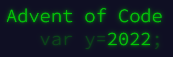

<!--
**ljdyer/ljdyer** is a ✨ _special_ ✨ repository because its `README.md` (this file) appears on your GitHub profile. -->

I am a highly skilled engineer with several years' experience using Python to build and deploy effective solutions in a fast-moving corporate environment at large, public-facing organisations. I am proficient in a wide range of Python libraries and am equally comfortable building and deploying bespoke web applications, managing complex end-to-end data pipelines, or developing and training state-of-the-art machine learning models. As a solo developer working on non-technical teams, I have developed the skills necessary to manage and coordinate all aspects of the software development lifecycle from requirement definition and project planning through to UAT and deployment.

&nbsp;&nbsp;&nbsp;

