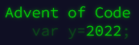

<!--
**ljdyer/ljdyer** is a ✨ _special_ ✨ repository because its `README.md` (this file) appears on your GitHub profile. -->

I am a programmer and linguist with several years' experience developing applications to support translation and localization efforts in the IT industry.

My main technical interests are natural language processing and machine/computer-aided translation. I combine my expertise in these fields with knowledge of web and software development to provide practical translation solutions to organisations working in multiple languages.

I am currently enrolled in the <a href="https://www.wlv.ac.uk/courses/ma-computational-linguistics/">MA Computational Linguistics</a> course at the University of Wolverhampton.

&nbsp;&nbsp;&nbsp;

